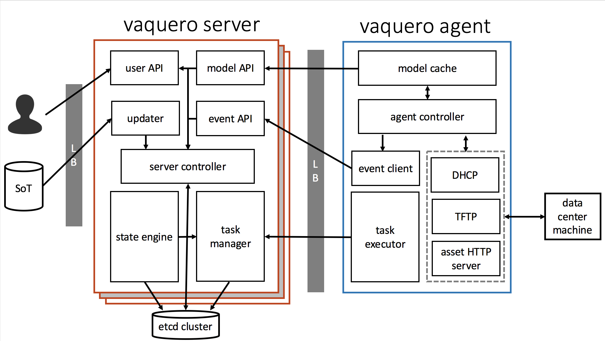

<head>
            <meta charset="UTF-8">
            <!--[if IE]><meta http-equiv="X-UA-Compatible" content="IE=edge"><![endif]-->
            <meta name="viewport" content="width=device-width, initial-scale=1.0">
            <title>Vaquero README</title>
            <link rel="stylesheet" type="text/css" href="../doc.css">
            <link rel='shortcut icon' href='cow.png' type='image/x-icon'/ >
            <link rel="stylesheet" href="https://fonts.googleapis.com/css?family=Open+Sans:300,300italic,400,400italic,600,600italic%7CNoto+Serif:400,400italic,700,700italic%7CDroid+Sans+Mono:400">
            <style>
                .markdown-body {
                    box-sizing: border-box;
                    min-width: 200px;
                    max-width: 1100px;
                    margin: 0 auto;
                    padding: 45px;
                }
            </style>
</head><article class="markdown-body">

<div align="center">

  <p style="font-size:60px">vaquero</p>
[Home](https://ciscocloud.github.io/vaquero-docs/) | [Dev Repo](https://github.com/CiscoCloud/vaquero) | [Docs Repo](https://github.com/CiscoCloud/vaquero-docs/tree/master) | [Project Requirements](requirements.html) | [Issue Tracking](https://waffle.io/CiscoCloud/vaquero)
</div>

<h1></h1>

A bare metal configuration utility that network boots machines based on user defined templates. We leverage iPXE and support cloud-config, ignition, kickstart, and untyped unattend boot scripts.

The only thing you need pre-installed to run Vaquero is [Docker](https://www.docker.com/).

See the [Getting Started](getting-started.html) page for details on deploying Vaquero in virtualbox.

## Features
(last update: November 2016)

### Complete:

**Operations / Deployment**:

- Operational simplicity: Vaquero is deployed from a single container that can run in server, agent, and standalone modes.
- Centralized control plane: Vaquero server is designed for high availability and linear scalability
- Site local vaquero agents are stateless and can be created and destroyed at will.
- Safe to run in a multi-tenant environment: Vaquero DHCP will only respond to known hosts in its data model.
- Vaquero agent implements a DHCP server that can run in proxy mode or full DHCP mode, with support for DHCP relay.
- Built-in authoritative detector notifies operator if an "authoritative" DHCP server is in the same broadcast domain.

**Booting**

- Hardware-agnostic bare metal management with pxe and IPXE-based network booting.
- Support and validation for kickstart, cloud-config, ignition, and custom unattended boot scripts
- Vaquero agent support for serving local files over http, or for acting as a reverse proxy for a CDN

**Tooling**

- CLI tooling to validate data model, and preview iPXE/unattended boot scripts before sending to hosts
- Robust Vagrant environment to test single-node deployments, or Vaquero server cluster and multiple agent deployments.


### In Progress:

**Operations / Deployment**:

- A pluggable framework to enable pre-shutdown actions to be taken on a single host to flush its workload before cutting the power
- A pluggable framework to enable post-boot actions to validate a successful deployment of a single host.
Vaquero servers act as a state machine that understands the current state physical hosts and desired state in the data model and able to migrate that site to the desired state.
- A policy engine that will ensure operational safety when updating a site, such as valid reboot times, minimum machines to be operational, dependency tracking and validation.
Vaquero servers able to handle failure states in boot process, will retry, halt, or revert based on user policy.

**Tooling:**

- User API that will grant operators insights into the state of their infrastructure


# [Architecture](architecture.html)


## [Data Model Templates](data-model-howto.html)
Data Models are used by Vaquero as the "Source of Truth" to describe your data center. Data Models define machine operating systems, subnets, and boot scripts. We provide some [example data models](https://github.com/CiscoCloud/vaquero-examples) as a reference to build your own.

Two notable branches in the example repo:

- [`master`](https://github.com/CiscoCloud/vaquero-examples): This will be updated to reflect a complete data model for reference. We will keep this single branch updated when an example of every supported feature, model type, and workflow is up. The master branch will be configured to run on localhost.

- [`vagrant`](https://github.com/CiscoCloud/vaquero-examples/tree/vagrant): Used for small deployments via vagrant in virtualbox. This branch may not show every feature, but it will be leveraged as a small scale example Data Model to deploy a few machines at most. This branch will contain a data model that will include definitions for the demos. See the [Getting Started](getting-started.html) page for for more info about the demos.

## Configuring and Running Vaquero

Vaquero can run in multiple modes: `server`, `agent`, and `standalone`. "Standalone" refers to running server and agent in the same container. A standalone configuration file, combining information needed to run both agent and server, is shown below.

See the [architecture page](architecture.html) for more details about server and agent.

************************************************************
**sample-standalone-config.yaml:**
```
ServerClient:
  Addr: "127.0.0.1"
  Port: 24601
  InsecureSkipVerify: true
ServerAPI:
  Addr: "127.0.0.1"
  Port: 24601
  PrivateKey: "functional/test/server.key"
  PublicKey: "functional/test/server.pem"
AssetServer:
  Addr: "127.0.0.1"
  Port: 24602
  BaseDir: "/var/vaquero/files"
  Scheme: http
DHCPMode: server
SavePath: "/var/vaquero"
Etcd:
  Endpoints:
  - "http://127.0.0.1:2379"
  Timeout: 5
  Retry: 3
Gitter:
  Endpoint: "/postreceive"
  Timeout: 2
  Addr: "127.0.0.1"
  Port: 24603
GitHook:
  - ID: "vaquero-git"
    Token: <GIT_TOKEN>
    URL: "https://github.com/CiscoCloud/vaquero-examples"
    Secret: supersecretcode
LocalDir:
  PollInterval: 10
SoT:
- Local:
    ID: "vaquero-local"
    Root: examples/etcd-cluster
- Git:
    HookID: "vaquero-git"
    ID: "vaquero-test"
    Branch: master
Log:
  Level: info
  Location: stdout
  LogType: text
```
************************************************************
### Configuration Fields Overview
- `ServerClient`: Configuration for vaquero-agent's ServerAPI client.
- `ServerAPI`: The vaquero-server api, used by vaquero agents.
- `AssetServer`: The asset server for Vaquero agent used by each booting machine to get unattended scripts and kernels.
- `Gitter`: Configuration for listening to git webhooks.
- `GitHook`: An array for all githooks to listen to.
- `SoT:` An array for specific sources of truth. Git updater receives webhooks from github. Local: will use a local directory to update.
- `Etcd`: The necessary information to connect a vaquero server cluster or High Availability (HA) cluster to a running [CoreOS Etcd](https://coreos.com/etcd/) cluster. If Etcd information is provided, Vaquero will use the provided cluster endpoints (vs. a local filestorage) to store and continuously update data model information, as well as internal, vaquero-specific information (eg. machine state). See the [Getting Started page](https://ciscocloud.github.io/vaquero-docs/docs/current/getting-started.html), under "Etcd and Vaquero," for more information, including a short demo using a virtual machine running Etcd.
- `SavePath`: If no Etcd details provided, the local dir where Vaquero servers and agents will save local configurations, as well as internal information (eg. machine state) needed for Vaquero to run.
- `DHCPMode`:Using "server" runs Vaquero as a DHCP server.  Vaquero does not manage free address pools or leases; it simply assigns based of the static configuration defined in the data model. **Note that DHCPMode defaults to server.** Using "proxy" enables ProxyDHCP. ProxyDHCP works with an existing DHCP Server to provide PXEBoot functionality, while leaving the managing and assigning of IP addresses to the other DHCP Server. Only enable this if you already have a DHCP server with entries for all the hosts in your Data Model.


### Configuration Fields In Detail

(Fields indicated as "Agent" and "Server" are by default included in Standalone mode. Forward-slashes in field names indicate YAML hierarchy)

| Mode   | Name                  | Required?         | Description                                                       | Default            |
|:-------|:----------------------|:------------------|:------------------------------------------------------------------|:-------------------|
| All    | Log/Level             | no                | Minimum Logging Level (debug, info, warning, error, fatal, panic) | info               |
| All    | Log/Location          | no                | Place to log: (stdout, stderr, `filename`)                        | stdout             |
| All    | Log/Type              | no                | Text / JSON output (text/json)                                    | text               |
| All    | SavePath              | no                | Base folder for vaquero save files                                | /var/vaquero       |
| Agent  | ServerClient/Addr     | no                | IP Address of vaquero-server's API.                               | 127.0.0.1          |
| Agent  | ServerClient/Port     | no                | Port of vaquero-server's API                                      | 24601              |
| Agent  | ServerClient/<br>InsecureSkipVerify      | no                | vaquero-agent should allow a self-signed server certificate.      | false
| Agent  | Assets/CdnScheme      | no                | Cdn scheme                                                        | http               |
| Agent  | Assets/CdnAddr        | no                | The address of the cdn endpoint to reverse proxy to               | none               |
| Agent  | Assets/CdnPort        | no                | The port of the cdn endpoint to reverse proxy to                  | none                  |
| Agent  | AssetServer/Addr      | no                | The IP Address to serve the agent asset server                    | 127.0.0.1          |
| Agent  | AssetServer/Port      | no                | The port to serve the agent asset server                          | 24602              |
| Agent  | AssetServer/Scheme    | no                | Asset server scheme : http / https                                | http               |
| Agent  | AssetServer/BaseDir   | no                | Agent directory to serve files from                               |  /var/vaquero/files |
| Agent  | DHCPMode              | no                | Agent DHCP Mode: server / proxy                                   | server             |
| Server | ServerAPI/Addr        | no                | The IP Address to serve the server REST API on                    | 127.0.0.1          |
| Server | ServerAPI/Port        | no                | The port to serve the server REST API on                          | 24601              |
| Server | ServerAPI/PrivateKey  | yes               | vaquero-server HTTPS/TLS Private Key                              | none               |
| Server | ServerAPI/PublicKey   | yes               | vaquero-server HTTPS/TLS Public Key                               | none               |
| Server | Etcd/Endpoints        | no                | etcd initial cluster endpoints: format- e1,e2,e3                  | none               |
| Server | Etcd/Retry            | no                | number of retries for etcd operations                             | 3                  |
| Server | Etcd/Timeout          | no                | etcd dial and request timeout, in seconds                         | 2                  |
| Server | Gitter/Endpoint       | no                | githook endpoint to receive webhooks                              | /postreceive       |
| Server | Gitter/Address        | no                | githook listening address                                         | 127.0.0.1          |
| Server | Gitter/Port           | no                | githook listening port                                            | 24603              |
| Server | Gitter/Timeout        | no                | githook timeout, in seconds                                       | 2                  |
| Server | GitHook/ID            | yes, if git SOT   | githook ID                                                        | none               |
| Server | GitHook/Token         | yes, if git SOT   | hook token, generated on github/settings                          | none               |
| Server | GitHook/URL           | yes, if git SOT   | url for githook                                                   | none               |
| Server | GitHook/Secret        | yes, if git SOT   | secret for githook                                                | none               |
| Server | SoT/Git/HookID        | yes, if git SOT   | git hookID                                                        | none               |
| Server | SoT/Git/ID            | yes, if git SOT   | ID (?)                                                            | none               |
| Server | SoT/Git/Branch        | yes, if git SOT   | SoT branch name                                                   | none               |
| Server | SoT/Local/ID          | yes, if local dir | local dir ID                                                      | none               |
| Server | SoT/Local/Root        | yes, if local dir | local root dir                                                    | none               |
| Server | LocalDir/PollInterval | no                | number of seconds between checks to that directory for updates    | 10                 |

## key generation
The Vaquero Server and Vaquero Agents communicate over HTTPS/TLS. The Vaquero Server requires a public/private keypair to start up. You may either use the provided sample keys ([public]( https://raw.githubusercontent.com/CiscoCloud/vaquero-vagrant/master/provision_files/server.pem), [private](https://raw.githubusercontent.com/CiscoCloud/vaquero-vagrant/master/provision_files/server.key)), or generate your own using the following commands:

```
openssl genrsa -out server.key 2048
openssl ecparam -genkey -name secp384r1 -out server.key
openssl req -new -x509 -sha256 -key server.key -out server.pem -days 3650
```

The configuration file for the server would include the following:

```
ServerAPI:
   PrivateKey: "path/to/server.key"
   PublicKey: "path/to/server.pem"
```
Alternatively, the `--server-private-key` and `--server-public-key` flags can be passed on the command line.


In a dev environment, a self signed key should sufficient, but in a production environment we highly suggest the keys be signed by a certificate authority. By default, Vaquero will not accept self-signed keys. To run insecurely, the agent config would need to include the following:

```
ServerClient:
   InsecureSkipVerify: true
```
Alternatively, the `-k` flag can be passed on the command line.

## secrets
The Vaquero APIs authenticate via JWT tokens. These require a server-secret and a shared-secret to be exported on the server and shared-secret and site-id must be exported on the agents. This can be done via the environment or command line:

### environment
Server:
```
export VAQUERO_SHARED_SECRET="HighlySecureSharedSecret"
export VAQUERO_SERVER_SECRET="SHHHHHHHDONTTELLANYONE"
```

Agent:
```
export VAQUERO_SHARED_SECRET="HighlySecureSharedSecret"
export VAQUERO_SITE_ID="test-site"
```

If exported in the environment, make sure to run sudo with the `-E` flag when running vaquero.
`sudo -E vaquero ...`

### command line
`vaquero server --shared-secret HighlySecureSharedSecret --server-secret SHHHHHHHDONTTELLANYONE`

`vaquero agent --site-id test-site --shared-secret HighlySecureSharedSecret`


## Running Vaquero from the container
[Bintray Docker Images](https://bintray.com/shippedrepos/vaquero/vaquero%3Avaquero)

1. Fetch the image: `docker pull shippedrepos-docker-vaquero.bintray.io/vaquero/vaquero:latest`
2. Run the example: `docker run -v /vagrant/vagrant-config.yaml:/vaquero/config.yaml -v /files:/tmp/vaquero/files --network="host" shippedrepos-docker-vaquero.bintray.io/vaquero/vaquero:latest standalone --config /vaquero/config.yaml`

    1. `docker volume` to pass the configuration into the container.
    2. `docker volume` to pass in the assetServer assets (kernel images, `undionly.kpxe`, etc)
    3. set networking to `host`

## Vaquero with Systemd
Vaquero can be started as a service using Systemd and Docker.

**`/etc/systemd/system/vaquero.service`**

************************************************************

```
[Unit]
Description=Vaquero Container
Requires=docker.service
After=docker.service

[Service]
Restart=always
ExecStart=/usr/bin/docker run --net host -v /var/vaquero/config.yaml:/config.yaml -v /var/vaquero/files:/var --name Vaquero shippedrepos-docker-vaquero.bintray.io/vaquero/vaquero:latest standalone --config /config.yaml
ExecStop=/usr/bin/docker stop vaquero
ExecStopPost=/usr/bin/docker rm -f vaquero

[Install]
WantedBy=default.target
```

************************************************************

This example:

1. Starts a Docker container named `vaquero` after the Docker service has started.
2. It starts using the parameters passed into `ExecStart`
3. `ExecStop` stops the `vaquero` container and is run when stopping the service.
4. `ExecStopPost` removes the `vaquero` container and is run after stopping the service.
5. It tries to restart the service.

Tips:

1. Make sure the Docker service is enabled on startup `sudo systemctl enable docker`
2. Check that the `vaquero` service isn't dying `sudo systemctl status vaquero`
3. See if the Docker container exists `sudo docker ps`
4. Flush the changes `sudo systemctl daemon-reload`
5. Restart both the `docker` and the `vaquero` services `sudo systemctl restart docker`
6. Make sure that pathing is correct for config and files required

## [Vaquero Validate](validator.html)
A CLI tool for validating your data model before you push it through Vaquero

## Sending Webhooks to Vaquero Master

1. Install [ngrok](https://ngrok.com/) to your local machine, unzip the package, and move the executable to `/usr/local/bin`.
2. Run ngrok on your physical machine `ngrok http 127.0.0.1:4816` or `ngrok http 4816`.
    1. Make sure that the address and port are the same as the Git Hook server in the config.
    2. It should follow `ngrok http <Gitter.Addr>:<Gitter.Port>`
3. Create a testing repo to launch webhooks from.
4. Give github.com the http endpoint provided by ngrok `http://0000ffff.ngrok.io/postreceive/vaquero-local`.
    1. This should be something like `<ngrok address>/<Gitter.Endpoint>/<GitHook.ID>`.
    2. The `Gitter.Endpoint` and the `GitHook.ID` are from the config.
5. Launch a webhook to hit the ngrok address.
    1. The `GitHook.Username`,`GitHook.Password`, and `GitHook.Secret` should be set in configuration to connect to the webhook of the `GitHook.URL`.
    2. Note that the `GitHook.Secret` can be left blank and should correspond to the Secret created when setting up the webhook on GitHub.
    3. Pushing to the repo, or `Redeliver Payload` on GitHub will launch a webhook.

## Docs
Build the documentation by running `godoc -http <port>` and open `localhost:<port>` on your web browser

## Swagger Docs
The User API has a [Swagger](http://swagger.io/tools/) document for ease of use. It can be used to generate code, or explore the exposed endpoints.

The interface can either be setup by following the instructions for the [Swagger UI](http://swagger.io/swagger-ui/) and serving the `swagUserAPI.yaml` file locally,
 or by going to the [Swagger UI demo](http://petstore.swagger.io/) and inputting the [RawGit](http://rawgit.com) hosted CORS-supported `https://cdn.rawgit.com/CiscoCloud/vaquero-docs/master/swagUserAPI.yaml`.

Additionally, the [Swagger Codegen](http://swagger.io/swagger-codegen/) can generate client side code for interacting with the provided endpoints.

## Questions / Comments / Feedback
To provide feedback to the team please email: [vaquero-feedback@external.cisco.com](mailto:vaquero-feedback@external.cisco.com)
For Issues, open at [CiscoCloud/vaquero-docs](https://github.com/CiscoCloud/vaquero-docs/issues)

<div><p style="font-size:12px">Logo created with: http://logomakr.com</p></div>
