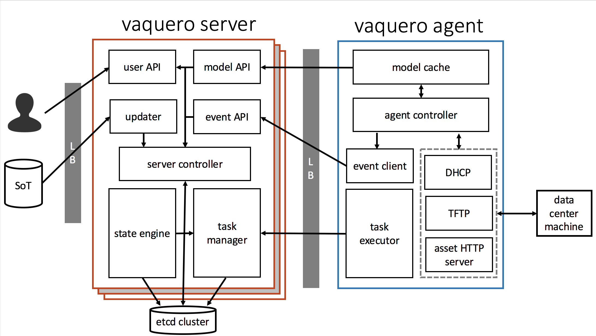
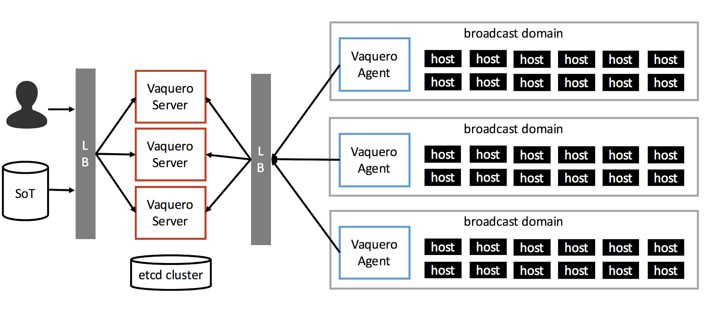

<head>
      <meta charset="UTF-8">
      <!--[if IE]><meta http-equiv="X-UA-Compatible" content="IE=edge"><![endif]-->
      <meta name="viewport" content="width=device-width, initial-scale=1.0">
      <title>Vaquero Architecture</title>
      <link rel="stylesheet" type="text/css" href="../doc.css">
      <link rel="stylesheet" href="https://fonts.googleapis.com/css?family=Open+Sans:300,300italic,400,400italic,600,600italic%7CNoto+Serif:400,400italic,700,700italic%7CDroid+Sans+Mono:400">
                <link rel='shortcut icon' href='cow.png' type='image/x-icon'/ >
      
</head><article class="markdown-body">

# Vaquero: Architecture
[Home](https://ciscocloud.github.io/vaquero-docs/) | [Docs Repo](https://github.com/CiscoCloud/vaquero-docs/tree/master)

**Last Updated**: November 2016

The Vaquero project is designed to simplify the provisioning and ongoing operations of clustered software on bare metal infrastructure. A running Vaquero system will be composed of a centralized control plane that automates provisioning of software in one or more data centers, and remote agents that take actions on boot hosts.

The goal is to provide the ability for teams to manage their infrastructure using the same tools they use for their applications (revision control, CI/CD pipeline, etc.), to and enable similar workflows including automated updates, gating, immutability, and A/B deployments. The final outcome will be a fully operational data center running heterogeneous deployments of clustered software on bare metal, with fully automated deployment and upgrades driven by a CI pipeline.

## Architecture

Vaquero is delivered in one container for operational simplicity. Vaquero can run in multiple modes, including server, agent, and standalone (the combination of server and agent).

#### `vaquero server`

The `vaquero` container in `server` mode implements the logic to receive updates from sources of truth and process the data model and make it a reality by providing information to agents. The vaquero server cluster leverages etcd to persist state, data models and configurations. Servers never call down to agents, they simply act as a distributed message queue for agents to fetch updates from, enabling scalable distributed servers.

1. **user API (in progress)** - REST API for users to interact with the system and provide operational insights into booting hosts.
2. **updater** - The interface that SoT's will go through to update their data models, could be listening for github webhooks or watching a source of truth directory for modifications.
3. **model API** - REST API that responds to agents looking to update their model cache, it will also provide a state manifest that enables an agent to know what state its booting hosts are in.
4. **event API** - REST API that receives events from long running services on agents.
5. **server controller** - The process that manages the numerous go routines on vaquero servers and acts as an intermediary between all server services.
6. **state engine (in progress)** - The brains behind vaquero, that will understand a data model, look at the events history and task history to understand what actions need to be taken to move booting hosts from one state to the next.
7. **task manager (in progress)** - A generic container task manager that knows how to run jobs on distributed task executors. A use case will be to run LOM containers that will execute on an agent to reboot a host, kicking off the re-provision process.

#### `vaquero agent`

The `vaquero` container running in `agent` mode registers itself with an upstream vaquero server and drives provisioning in a local datacenter. The agent is designed in such a way that it is stateless, agents can be created and destroyed at will. They will obtain state, configuration, actions from the vaquero server cluster.

1. **model cache** - is the local cached representation of the infrastructure, the model cache handles updating with the vaquero server cluster just in time when the vaquero agent needs it. It can also be used during network outages, so agents can still serve their booting hosts without connection to the server cluster.
2. **agent controller** - The process that manages multiple go-routines and acts as an intermediary between agent services.
3. **DHCP** - a DHCP server implemented in go that can run as a DHCP proxy, serving network boot details only, or as a fully featured DHCP server providing IP addresses and network boot details. Validated to work with a DHCP relay as well.
4. **TFTP** - a TFTP server that only serves the [`undionly.kpxe` file](http://ipxe.org/howto/chainloading).
5. **asset HTTP server** - implements a file server or reverse proxy to forward requests to a CDN. This delivers unattend boot scripts, kernels, and initrds.
6. **event client** - an HTTP client that reports long running service events back (DHCP, TFTP, HTTP) to the vaquero server cluster. (the servers leverage this information to understand what state booting hosts are in)
7. **task executor (in progress)** - a generic container execution runtime. It will receive "tasks" or containers to run from a centralized task manager, run it and return the exit code and logs. Vaquero will leverage this for LOM management and running pre-reboot and post-reboot containers to flush and validate state on a host.

#### Walking through an update
1. SoT updated
2. updater fetches update
3. server controller receives event and stores model in etcd
4. state engine computes differences between current state and new desired state from the SoT.
5. state engine creates LOM tasks for related task executors to reboot hosts
6. vaquero agent task executor obtains and runs LOM task to reboot hosts
7. host boots and begins DHCP / TFTP / HTTP process in network boot
8. model cache and state manifest is updated via model API for the above 3 services (just in time updating)
9. events are reported to vaquero server
10. state engine observes events status and tasks status and will act until desired state is reached

## HA Vaquero

The diagram below depicts what a production deployment of Vaquero would look like. The Vaquero server cluster would be deployed and backed by an etcd cluster. Vaquero servers act like a distributed message queue for its agents, servers never instantiate outbound calls. Vaquero agents would be deployed to service one data model "site", technically two agents could run in the same broadcast domain as long as they each server different hosts in the broadcast domain. We would recommend deploying one Vaquero agent per broadcast domain. Requirements for a production deployment would include [Docker](https://www.docker.com/), [etcd](https://github.com/coreos/etcd), and a load balancer of your choice. See the [outage document](outage.html) to see how Vaquero handles failures.

## Deployment and Availability Considerations

Please see the [README](README.html) for details on production deployments, considerations, and requirements. See the [outage doc](outage.html) to see how vaquero handles certain failure scenarios.
