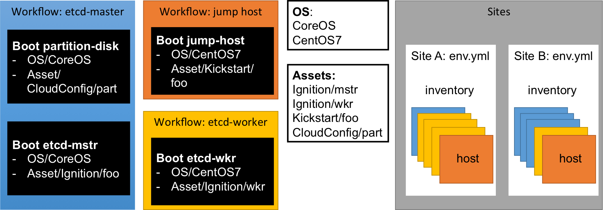

<head>
            <meta charset="UTF-8">
            <!--[if IE]><meta http-equiv="X-UA-Compatible" content="IE=edge"><![endif]-->
            <meta name="viewport" content="width=device-width, initial-scale=1.0">
            <title>Vaquero Data Model</title>
            <link rel="stylesheet" type="text/css" href="../doc.css">
            <link rel="stylesheet" href="https://fonts.googleapis.com/css?family=Open+Sans:300,300italic,400,400italic,600,600italic%7CNoto+Serif:400,400italic,700,700italic%7CDroid+Sans+Mono:400">
                      <link rel='shortcut icon' href='cow.png' type='image/x-icon'/ >
            <style>
                .markdown-body {
                    box-sizing: border-box;
                    min-width: 200px;
                    max-width: 1200px;
                    margin: 0 auto;
                    padding: 45px;
                }
            </style>
</head><article class="markdown-body">

# The Vaquero Data Model and YOU
[Home](https://ciscocloud.github.io/vaquero-docs/) | [Docs Repo](https://github.com/CiscoCloud/vaquero-docs/tree/master)

- [Example Data Models](https://github.com/CiscoCloud/vaquero-examples)

## Data Model Diagram to show relationships
Each site contains an `environment file` and an `inventory file` that lists all related hosts. Hosts are members of a single `workflow`. `workflow` is a collection of 'boot' steps that take a new machine and bring it to its final state. A `boot` contains `os` and `assets`. Note re-use of `boot`, `os` and `assets`.



## Table of Contents

1. [Key Concepts](#key-concepts)

2. [Vocabulary](#vocabulary)

3. [Where things go](#where-things-go)

4. [Provisioning Steps](#provisioning-steps)

5. [Serving files](#serving-files)

6. [Metadata and Templating](#metadata-and-templating)

7. [Translation to iPXE](#translation-to-ipxe)

8. [Schemas](#schemas)

9. [Staging Updates](#staging)

### Introduction

The Vaquero data model is meant to be a declarative representation of the state of your data center. You specify the state you want your baremetal to be in, and Vaquero takes the steps to get there.

We treat this data model as a "single source of truth" (SoT) that describes the operating state of your data center. The data model is [parsed and verified](validator.html), then deployed to an on-site Vaquero Agent for execution.

## <a name="key-concepts">Key Concepts</a>

Your data center is expressed as an inventory of _hosts_. Each host belongs to a _workflow_. Each workflow is comprised of one or many _boot_ steps that use a combination of _unattended assets_ and _operating system_ definitions to define a target configured state for a host.

## <a name="vocabulary">Vocabulary</a>

*Site*: A managed data center, or group of machines managed by a single Vaquero Agent.

*Host*: A single managed machine. Definition includes identifying attributes (selectors), host-specific metadata, information for LOM (IPMI), and an association to a single workflow.

*Operating System*: An "installation" template containing the details to perform a network boot into a particular OS, specifying kernel, initrd, boot command-line parameters, unattended config, etc.

*Unattended Assets*: An optionally templated unattended config/script (i.e. cloud-init, ignition, kickstart, etc) used for unattended boot and installation operations.

*Boot*: A collection that ties together operating systems and unattended assets. Describes a single network boot.

*Workflow*: A series of network boots that end with a host machine in a desired state.

## <a name="where-things-go">Where Things Go</a>

Configuration files are placed in a directory hierarchy. Vaquero parses site configurations by reading files placed in specially named subdirectories. The root of your configuration path has four directories:

1. **assets**: grouped by type. These are generally unattended configs or scripts that have been templated to include environment-specific information. Contains named subdirectories (more on that later).
2. **os**: Individual documents, each representing an Operating System
3. **boot**: Individual documents, each representing a Boot
4. **sites**: One or more sites (each in it's own subdirectory) that share the same boot, os, and asset definitions. Each site includes environment-specific information (Vaquero Agent URLs/certs, subnets, other metadata), and an inventory of hosts that apply boot definitions to machines.
5. **workflows**: Individual documents, each representing a Workflow

```
.
├── assets
├── os
├── boot
├── sites
└── workflows

```

### Assets

Assets are grouped into named subdirectories based on type. There are currently four types:

1. Cloud-Config: [CoreOS Cloudinit System](https://coreos.com/os/docs/latest/cloud-config.html)
2. Ignition: [CoreOS Ignition](https://coreos.com/ignition/docs/latest/)
3. Kickstart: [Fedora Project Kickstart](http://fedoraproject.org/wiki/Anaconda/Kickstart)
4. Untyped: Miscellaneous files. Can be used for "unsupported" configuration types.

Each subdirectory may also have a `snippets` directory for holding partial templates (see below)

Each asset is placed under a subdirectory according to it's type. Assets are referenced by file name from boots:

```
.
└── assets
    ├── cloud-config
    │   └── base.yml
    ├── ignition
    │   ├── etcd.yml
    │   └── raid-fmt.yml
    ├── kickstart
    │   ├── snippets
    │   │   ├── snip1
    │   │   └── snip2
    │   └── centos.ks
    └── untyped
        ├── autoyast.xml
        └── preseed.cfg
```


Validation is performed on typed assets to verify that rendered templates produce valid configuration scripts.

Assets are retrieved dynamically from the Vaquero Agent asset server through the `/config/<mac-addr>` endpoint. An optional `boot` query parameter can be used to specify the ID of the Boot to use.

For instance, a host with mac address `00:00:00:00:00:01` could retrieve it's default configuration by requesting

```
{{.env.assetURL}}/config/00:00:00:00:00:01
```

Or the configuration from a particular boot by requesting

```
{{.env.assetURL}}/config/00:00:00:00:00:01?boot=specific-boot-id
```

#### Asset Snippets

Any snippets for a particular config type are _always included_ when rendering configurations of that type. Most of the time, the preferred use will be to have the snippet file `define` a template, and use the `template` function to include it in the configuration:

```
/assets/kickstart/snippets/snip1

{{ define "snippet-id-1" }}
  # Template here
{{ end }}
```

```
/assets/kickstart/centos.ks

# My kickstart template
{{ template "snippet-id-1" . }}

```

### Operating Systems

Operating systems exist as individual documents under the `os` subdirectory. They are referenced by a self-assigned ID described in the document:

```
.
└── os
    ├── centos-7.yml
    ├── clevos-3.yml
    └── coreos-1053.12.0.yml
```

### Boot

Boots exist as individual documents under the `boot` subdirectory. They are referenced by a self-assigned ID described in the document:

```
.
└── boot
    ├── etcd-cluster.yml
    └── etcd-proxy.yml
```

### Sites

Sites are represented by individual subdirectories. One directory == one site == one managed group of machines. Each SoT can contain multiple sites. Each of these sites shares the same assets/boot/os configuration files.

Each site has _at least_ two documents, the specially named `env.yml` and at least one document describing an inventory of hosts. You may use YAML's triple-dash `---` separator to combine multiple inventory documents into one file.

```
.
└── sites
    ├── site-a
    │   ├── env.yml
    │   └── inventory.yml
    └── site-a
        ├── env.yml
        ├── inventory.yml
        └── another-inv.yml
```

### Workflows

Workflows exist as individual documents under the `workflows` subdirectory. They are referenced by a self-assigned ID described in the document:

```
.
└── workflows
    ├── clevos-accessor.yml
    ├── k8s-master.yml
    └── k8s-node.yml
```

## <a name="provisioning-steps">Provisioning Steps</a>

Configurations are roughly executed in the following order:

1. Host makes DHCP request.
2. DHCP causes host to chainload iPXE (`undionly.kpxe`) and indicates Vaquero Agent as next-server
3. Vaquero Agent provides a default iPXE script to discover basic host information (mac, uuid, domain, hostname)
4. Host requests dynamic iPXE script based on basic information
5. Vaquero Agent renders iPXE script using os, boot, and host information
6. Host executes iPXE script, requesting resources (kernel, intitrd, unattended configs/scripts) as required

The default ipxe script chains back to Vaquero Agent, injecting basic information:

```
#!ipxe
chain ipxe?uuid=${uuid}&mac=${net0/mac:hexhyp}&domain=${domain}&hostname=${hostname}&domain=${domain}
```


## <a name="serving-files">Serving Files</a>

Vaquero Agent will expose an endpoint `/files` for hosting static content. This endpoint acts transparently as a file server, or a reverse proxy, according to the configuration file.

## Identifying a Host

A booting machine is identified as a particular host based on the selecting information used. Currently, a host will be identified by `mac` and `uuid`, as reported by iPXE.

Additionally, a specific callback may be made to Vaquero Agent that includes a custom selection parameter

```
curl "{{.agent.url}}/ignition?mac={{.host.mac}}&os=installed" -o ignition.json
```


When identifying a host, Vaquero Agent will:

1. Only select a host where all the selectors apply
2. Select the host where the most selectors apply

For example, given these two hosts:

```
---
boot: group_one
hosts:
- name: host1
  selectors:
    mac: 00:00:00:00:00:01
---
boot: group_two
hosts:
- name: host1_plus_some
  selectors:
    mac: 00:00:00:00:00:01
    os: installed
```


For a host requesting `/ignition?mac=00:00:00:00:00:01`, group_one will be matched (rule #1).
For a host requesting `/ignition?mac=00:00:00:00:00:01&os=installed`, group_two will be matched (rule #2).


## <a name="metadata-and-templating">Metadata and Templating</a>

Templates are written using [Go's standard templates](https://golang.org/pkg/text/template/). Templated information occurs in the following areas:

1. In any files under `assets`
2. In os objects in `boot.kernel`, `boot.initrd`, and values in `cmdline`

Metadata is used primarily to render templated information. It is "unstructured" data, consisting of nested key-value maps, and lists. Metadata is included in three separate places in your configuration:

1. In the environment `env.yml` file
2. In a boot file
3. In an inventory document, under each host

Metadata is made available during template execution as separate fields under the template's "dot". With a few exceptions, each entry directly relates to the scheme. The cases where proxies or other values are included are noted:

1. `.env`: the site's Environment information.
  - `.env.agentURL`: The scheme://host:port that the host can use to reach Vaquero Agent.
2. `.boot`: the current Boot
  - `.boot.configURL`: The scheme://host:port/path?query needed to retrieve the unattended configuration information for the boot. Used for manually inserting config retrieval, i.e. ClevOS answers.
  - `.boot.{operating_system,os}`: the OS ID is replaced with the Operating System object that it refers to
3. `.host`: the current Host
  - `.host.interfaces.subnet`: subnet ID is replaced with Subnet object that it refers to
4. `.interface`: the Interface that the Host is using to connect with Vaquero Agent
  - `.interface.subnet`: subnet ID is replaced with Subnet object that it refers to

* Any object/scheme that includes `metadata` proxies the same information under `md`
* ex: `env.metadata.initial_etcd_cluster` == `env.md.initial_etcd_cluster`

By way of example, this template snippet defines a networkd configuration:

```
networkd:
  units:
    - name: 10-static.network
      contents: |
        [Match]
        MACAddress={{.interface.mac}}
        [Network]
        Gateway={{.interface.subnet.gateway}}
        DNS={{index .interface.subnet.dns 0}}
        Address={{.interface.ipv4}}
```

## <a name="translation-to-ipxe">Translation to iPXE</a>

Currently, all network boots and installations are performed using iPXE scripts. Operating system boot parameters and command line options are translated into iPXE scripts to perform boot/installation tasks.

Any unattended configs or scripts included in a boot are inserted during this process. Inconsistencies (i.e. using ignition for a CentOS operating system) should be detected during validation.

### Command Line Parameters

Rules for translating command line parameters:

1. Keys with empty values (i.e. "" or '') are formatted as `key` in the boot options
2. Keys with non-empty values are formatted as `key=value` in the boot options
3. Keys that contain a list will be included once each time for every list element. If a list element cannot be parsed not a string (i.e. is a map, list, etc), it is ignored.

For example, given this OS:

```
---
id: centos-example
major_version: '7'
minor_version: '2'
os_family: CentOS
release_name: stable
boot:
  kernel: centos_kernel
  initrd:
  - centos_initrd
cmdline:
  console:
    - ttyS0,115200
    - ttyS1
    - nested_map: is
      ignored: true
    - same:
      - with
      - nested
      - lists
  lang: ' '
  debug: ''
  enforcing: ''
```


The iPXE script will be roughly generated as (not taking unattended info from boot):

```
    #!ipxe
    kernel centos_kernel console=ttyS0,115200 console=ttyS1 lang=  debug enforcing
    initrd centos_initrd
    boot
```


Note how `lang` appears with a trailing `=`, because it's value was non-empty `' '`


## <a name="schemas">Schemas</a>

### boot

Defines a configured state (combination of os with unattended configuration and metadata) that may be applied to a group of hosts.

| name             | description                                               | required | schema          | default |
|:-----------------|:----------------------------------------------------------|:---------|:----------------|:--------|
| id               | A self-assigned identifier (should be unique)             | yes      | string          |         |
| name             | A human-readable name for this group                      | no       | string          | id      |
| operating_system | The ID of the os associated with this group               | yes      | string          |         |
| unattended       | Unattended config/script details                          | no       | boot.unattended |         |
| metadata         | unstructured, boot-specific information                   | no       | object          |         |
| validate         | A series of containers run to ensure proper configuration | no       | container       |         |
| before_shutdown  | Containers to run before a manual reboot/reprovision      | no       | container       |         |

#### boot.unattended

Allow a network boot or installation to proceed automatically by providing canned answers.


| name | description                                             | required | schema | default |
|:-----|:--------------------------------------------------------|:---------|:-------|:--------|
| type | The type of unattended config/script to use             | yes      | string |         |
| use  | The file name used to find the unattended config/script | yes      | string |         |

#### container

TBD

### env

Provides information for a single deployment/data center/etc.


| name         | description                                               | required | schema           | default |
|:-------------|:----------------------------------------------------------|:---------|:-----------------|:--------|
| id           | A self-assigned identifier (should be unique)             | yes      | string           |         |
| name         | A human-readable name for this group                      | no       | string           | id      |
| agent        | Details for establishing a connection to the site's agent | yes      | env.agent        |         |
| subnets      | List of subnets for this cluster                          | yes      | env.subnet array |         |
| metadata     | unstructured, site-specific information                   | no       | object           |         |
| release_tag  | Github release tag                                        | no       | string           |         |


### env.release_tag
`release_tag` must be a valid [git tag](https://git-scm.com/book/en/v2/Git-Basics-Tagging) corresponding to a specific [Github Release](https://help.github.com/articles/about-releases/) (e.g., v0.1.0).

If `release_tag` is specified, Vaquero will attempt to use the data model stored in the specified release instead of _this_ model (i.e. where release_tag was specified). If the tag does not exist, Vaquero will fall back to using _this_ model.

##### Example
Branch `master` defines three sites, `site-a`, `site-b`, and `site-c`. `site-a` has `release_tag=v0.1.0`, `site-b` has `release_tag=v0.1.1` and `site-c` does not have `release_tag` set.

When Vaquero loads `master`, it will end up using three different data models for the three different sites. `site-a` will get the version of itself defined in release `v0.1.0`, `site-b` will get `v0.1.1` and `site-c` will get the version defined in `master`.

This option is only supported when [staging via Github](#staging).

#### env.agent

Details for establishing a connection to a site's agent


| name        | description                           | required | schema  | default           |
|:------------|:--------------------------------------|:---------|:--------|:------------------|
| url         | Insecure/local url for reaching agent | yes      | string  | http://127.0.0.1  |
| port        | Port for insecure URL                 | yes      | integer | 80                |
| secure_url  | Secure/remote url for reaching agent  | yes      | string  | https://127.0.0.1 |
| secure_port | Port for secure URL                   | yes      | integer | 443               |
| cert_path   | A path to the TLS cert                | yes      | string  |                   |


The transport (http/s) should be included with the agent URL.

#### env.subnet

| name         | description                                          | required | schema             | default |
|:-------------|:-----------------------------------------------------|:---------|:-------------------|:--------|
| id           | A self-assigned identifier (should be unique in env) | yes      | string             |         |
| cidr         | CIDR for this subnet                                 | yes      | string             |         |
| dns          | List of DNS URLs                                     | yes      | string array       |         |
| ntp          | List of NTP URLs                                     | yes      | string array       |         |
| gateway      | Gateway for this subnet                              | no       | string             |         |
| domain_name  | Domain name for this subnet                          | no       | string             |         |
| vlan         | VLAN for the subnet                                  | no       | integer            | 1       |
| dhcp_options | Additional DHCP options                              | no       | dhcp_options array |         |
| metadata     | unstructured, host-specific information              | no       | object             |         |


#### env.subnet.dhcp_options

Represents a single DHCP Option as defined in [RFC2132](http://www.iana.org/go/rfc2132) or listed in [this IANA table](http://www.iana.org/assignments/bootp-dhcp-parameters/bootp-dhcp-parameters.xhtml) of BOOTP Vendor Extensions and DHCP Options.


| name   | description                                       | required | schema   | default                                                                                                      |
|:-------|:--------------------------------------------------|:---------|:---------|:-------------------------------------------------------------------------------------------------------------|
| option | DHCP option tag.                                  | yes      | uint8    |                                                                                                              |
| value  | List of DNS URLs                                  | yes      | variable |                                                                                                              |
| type   | Denotes the type of `value`. Accepted values:     | yes      | string   |                                                                                                              |
|        | string, uint8, uint16, uint32, int8, int16, int32 |          |          |                                                                                                              |
|        | addresses*, base64**                              |          |          | |         |         |                                                      |          |                    | |

\* Type `addresses` is a comma seperated string of ip addresses.

\** Type `base64` is a base64 encoded value.

[Examples](dhcp-options.html)

| name    | description                                          | required | schema       | default |
|:--------|:-----------------------------------------------------|:---------|:-------------|:--------|
| id      | A self-assigned identifier (should be unique in env) | yes      | string       |         |
| cidr    | CIDR for this subnet                                 | yes      | string       |         |
| dns     | List of DNS URLs                                     | yes      | string array |         |
| ntp     | List of NTP URLs                                     | yes      | string array |         |
| domain  | Client DNS domain                                    | no       | string       |         |
| gateway | Gateway for this subnet                              | no       | string       |         |
| vlan    | VLAN for the subnet                                  | no       | integer      | 1       |

#### host

| name       | description                                        | required | schema    | default |
|:-----------|:---------------------------------------------------|:---------|:----------|:--------|
| name       | Name for the host machine.                         | yes      | string    |         |
| interfaces | Network intefaces for this host                    | no       | interface |         |
| metadata   | unstructured, host-specific information            | no       | object    |         |
| workflow   | The ID of the workflow used to provision this host | yes      | string    |         |


#### interface

| name        | description                                                | required | schema        | default |
|:------------|:-----------------------------------------------------------|:---------|:--------------|:--------|
| type        | Interface type. Physical/bmc                               | yes      | string        |         |
| mac         | MAC address identifying this interface                     | yes      | string        |         |
| subnet      | ID of subnet (specified in env)                            | yes      | string        |         |
| bmc         | Details for BMC interface                                  | no       | interface.bmc |         |
| identifier  | Identifier for interface                                   | no       | string        |         |
| ignore_dhcp | If true, stops Vaquero from provisioning on this interface | no       | boolean       |         |
| ipv4        | IPv4 address                                               | yes      | dotted quad   |         |
| ipv6        | IPv6 address                                               | no       | string        |         |
| hostname    | Hostname for machine                                       | no       | string        |         |

#### interface.bmc

| name     | description                        | required | schema | default |
|:---------|:-----------------------------------|:---------|:-------|:--------|
| type     | Specifies protocol type. IPMI/CIMC | yes      | string |         |
| username | User for managing BMC              | yes      | string |         |
| password | Password for specified user        | yes      | string |         |

### os

Represents a single operating system with boot/installation parameters.


| name          | description                      | required | schema  | default |
|:--------------|:---------------------------------|:---------|:--------|:--------|
| id            | self-assigned identifier         | yes      | string  |         |
| name          | human-readable name              | yes      | string  | id      |
| major_version | major version                    | yes      | string  |         |
| minor_version | minor version                    | no       | string  |         |
| os_family     | family (i.e. CoreOS, CentOS)     | yes      | string  |         |
| release_name  | release name (i.e. stable, beta) | no       | string  |         |
| boot          | kernal & initrd img info         | yes      | os.boot |         |
| cmdline       | boot/installation options        | no       | object  |         |


Cmdline values may be templated. They will be rendered on-demand for inidividual hosts.

#### os.boot

Contains information about the kernal/initrds for an operating system.


| name   | description                             | required | schema       | default |
|:-------|:----------------------------------------|:---------|:-------------|:--------|
| kernel | URL for retrieving kernel on boot       | yes      | string       |         |
| initrd | URL for retrieving initrds/imgs on boot | yes      | string array |         |


Kernel and initrd values may be templated. They will be rendered on-demand for inidividual hosts.

#### workflow

A workflow chains multiple boots together to provision a host. The workflow is also responsible for specifying basic policy for rebutting hosts that use it.

| name           | description                                             | required | schema               | default |
|:---------------|:--------------------------------------------------------|:---------|:---------------------|:--------|
| id             | self-assigned identifier                                | yes      | string               |         |
| workflow       | Series of boots to provision the host                   | yes      | workflow.stage array |         |
| max_concurrent | Max simultaneous hosts actively provisioning            | no       | int                  | 0       |
| safe_deps      | IDs of safe dependency workflows                        | no       | string array         |         |
| block_deps     | IDs of blocking dependency workflows                    | no       | string array         |         |
| validate_on    | IDs of workflows that cause this workflow to revalidate | no       | string array         |         |
| max_fail       | How many hosts can fail before halted                   | no       | int                  | 0       |


## <a name="staging">Staging Updates</a>

Github will be used to stage models for updating, vaquero will receive webhooks from specified branches. Submitting PR's and merging other branches into the vaquero branch would be how teams manage updating their source of truth. Once a model lands in the branch vaquero is watching, it will push it out and begin provisioning against that source of truth.
