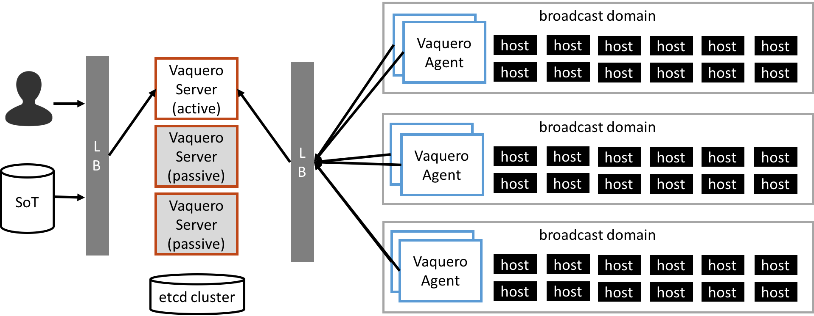

<head>
            <meta charset="UTF-8">
            <!--[if IE]><meta http-equiv="X-UA-Compatible" content="IE=edge"><![endif]-->
            <meta name="viewport" content="width=device-width, initial-scale=1.0">
            <title>Vaquero Getting Started</title>
            <link rel="stylesheet" type="text/css" href="../doc.css">
            <link rel="stylesheet" href="https://fonts.googleapis.com/css?family=Open+Sans:300,300italic,400,400italic,600,600italic%7CNoto+Serif:400,400italic,700,700italic%7CDroid+Sans+Mono:400">
                      <link rel='shortcut icon' href='cow.png' type='image/x-icon'/ >
            
</head><article class="markdown-body">

# Outage Scenarios and Vaquero Behaviors

[Home](https://ciscocloud.github.io/vaquero-docs/) | [Docs Repo](https://github.com/CiscoCloud/vaquero-docs/tree/master)

This document outlines vaquero's functionality in outage scenarios. In this analysis we are looking at a deployment of 3 vaquero servers.

- SoT : Source of Truth: the home for the data model
- VS : Vaquero Server
- VA : Vaquero Agent
- KV : Key value storage

| Outage                       | Effected Vaquero Functionality                                                                                                                                | Acceptable Outage          |
|:-----------------------------|:--------------------------------------------------------------------------------------------------------------------------------------------------------------|:---------------------------|
| SoT -> VS                    | Vaquero Server cannot update its source of truth, it will assume it has the most recent model.                                                                | Y (potential for stale DM) |
| VS -> VA                     | Vaquero Agents will take no new actions, but can restore booting hosts to their last known state. Will not run validation or shutdown any new hosts             | Y (potential for stale DM) |
| Active VS leader down                   | If the active VS goes down, a passively campaigning VS will take on the role of active              | Y |
| Passive VS down                   | If a campaigning VS goes down, the cluster will be unaffected             | Y (but fewer HA servers is not HA)|
| All VS down                    | If the entire cluster of VS machines goes down (including the leader VS), this is catastrophic because nothing is serving to the VAs                                   | N |
| VA Outage                    | A VA outage would be catastrophic for the site that agent is mangaging, but will have no effects across the system or other Agents                            | Y for system as a whole    |
| VS Load Balancer / VirtualIP | System will still work if only one vaquero server is up and being reached directly by the SoTs, users and agents.                                             | Y  (given routable VS)     |
| VA -> Host                   | Machines will not be able to boot, vaquero is effectively useless for that agent's site, but as a system vaquero still works and models are updated properly. | Y                          |
| VS -> KV                     | VS must shut down, because servers have lost the ability to participate in leader election, obtain models/status, and stay synchronized                                                                  | N                          |
